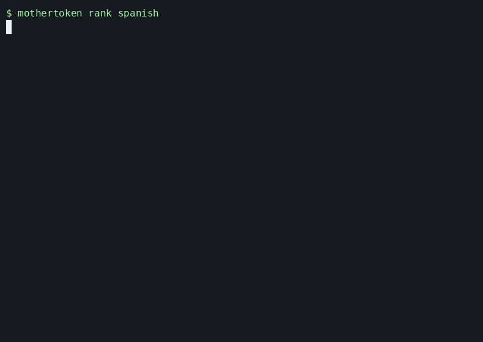
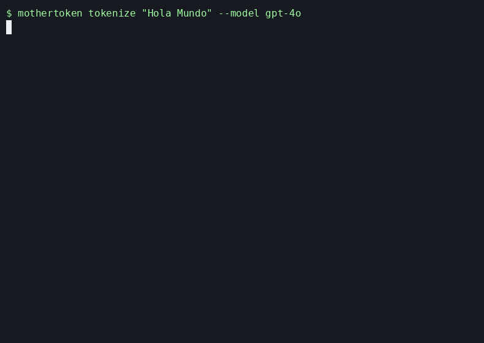
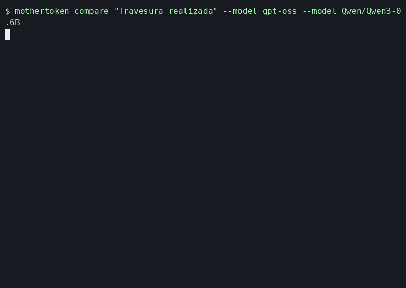
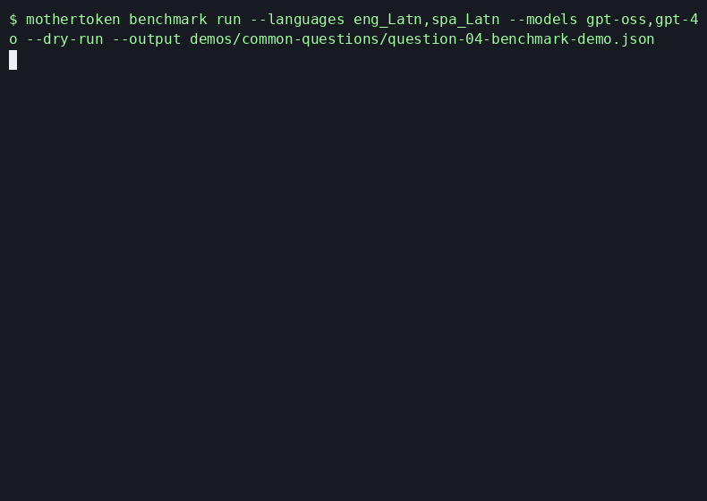

<p align="center">
  
</p>

# mothertoken

> *Every model has a native tongue. The question is whether yours matches.*

Toolkit for comparing tokenizer efficiency across languages, model families, and user-supplied Hugging Face refs.

> [!NOTE]
> The bundled benchmark is curated and representative, not exhaustive. Use direct Hugging Face refs when you want to compare tokenizers outside the starter set.

## Installation

```bash
# Published package
pip install mothertoken
```

For local development:

```bash
git clone https://github.com/inimaz/mothertoken
cd mothertoken
uv sync
uv pip install -e .
```

## CLI Usage

The `mothertoken` command is available after installation.

### Common questions

#### I speak a language that is not English. Which tokenizer is most efficient for it?

```bash
mothertoken rank spanish
```

<details>
<summary>Show demo</summary>



[Asciinema source](demos/common-questions/01-rank-spanish.cast)

</details>

#### I have this text and a chosen model. How many tokens does it use?

```bash
mothertoken tokenize "Hola Mundo" --model gpt-4o
```

<details>
<summary>Show demo</summary>



[Asciinema source](demos/common-questions/02-tokenize-hola-mundo.cast)

</details>

#### I am choosing between a few models. Which one tokenizes my text best?

```bash
mothertoken compare "Travesura realizada" --model gpt-oss --model Qwen/Qwen3-0.6B
```

<details>
<summary>Show demo</summary>



[Asciinema source](demos/common-questions/03-compare-travesura.cast)

</details>

#### I have this model. Which languages does it tokenize best, which ones worst?

```bash
mothertoken benchmark run --models gpt-oss,YOUR_MODEL1,YOUR_MODEL2
```

<details>
<summary>Show demo</summary>



[Asciinema source](demos/common-questions/04-benchmark-models.cast)

</details>

### Rank tokenizers for a language
Rank supported tokenizers for a specific language using the precomputed benchmark data.
```bash
mothertoken rank spanish

# Raw FLORES+ codes still work
mothertoken rank spa_Latn
```

### List tokenizers
See which tokenizer IDs can be used and which familiar models use them.
```bash
mothertoken list
```

### Tokenize exact text
Count tokens for exact text using local tokenizers by default. Add `--language` to estimate the English-equivalent token count from the benchmark multiplier.
```bash
mothertoken tokenize "Hola Mundo" --language es

# Check one model
mothertoken tokenize "Hello" --model gpt-4o

# Check a Hugging Face model/tokenizer ref directly
mothertoken tokenize "Hello" --model Qwen/Qwen3-0.6B

# Estimate the English-equivalent count for a known language
mothertoken tokenize "مرحبا بالعالم" --language ar --model gpt-4o

# Compare against your own English translation
mothertoken tokenize "مرحبا بالعالم" --language ar --english-text "Hello world"

# Tokenize a file
mothertoken tokenize --file prompt.txt

# Compare translated files
mothertoken tokenize --file prompt.ar.txt --language ar --english-file prompt.en.txt
```

### Compare selected tokenizers
Compare aliases from `mothertoken list` with direct Hugging Face refs. This is the main workflow when you care about a specific set of models.
```bash
mothertoken compare "Travesura realizada" \
  --model gpt-4o \
  --model Qwen/Qwen3-0.6B \
  --model mistralai/Mistral-7B-v0.1

mothertoken compare --file prompt.txt \
  --model mistralai/Mistral-7B-v0.1 \
  --model deepseek-ai/DeepSeek-V4-Pro
```

### Benchmark data
`mothertoken benchmark` shows benchmark help. Use `benchmark run` to create benchmark data, `benchmark use` to choose the active benchmark, and `benchmark status` to inspect what commands will use.

When `--output` is omitted, `benchmark run` writes to the user-owned benchmark file and makes it active:

```bash
mothertoken benchmark run --languages eng_Latn,arb_Arab --models gpt-4o,Qwen/Qwen3-0.6B
```

Before it starts, the command prints the file it will write. The default user config locations are platform-specific:

| OS | User config directory |
| --- | --- |
| Linux / XDG | `$XDG_CONFIG_HOME/mothertoken` or `~/.config/mothertoken` |
| macOS | `~/Library/Application Support/mothertoken` |
| Windows | `%APPDATA%\mothertoken` |

To write somewhere else:

```bash
mothertoken benchmark run \
  --languages eng_Latn,arb_Arab \
  --models gpt-4o,Qwen/Qwen3-0.6B \
  --output benchmark.json
```

Make an existing benchmark active:

```bash
mothertoken benchmark use benchmark.json
mothertoken benchmark status
```

Return to the bundled default benchmark:

```bash
mothertoken benchmark use --default
```

---

## Researcher Workflow

Benchmark regeneration and model-extension docs live in [`docs/benchmarking.md`](docs/benchmarking.md).

You can also benchmark a direct Hugging Face ref without adding it to `default_tokenizers.yaml`:

```bash
uv run mothertoken benchmark run --languages eng_Latn,arb_Arab --models Qwen/Qwen3-0.6B
```

## License
MIT
